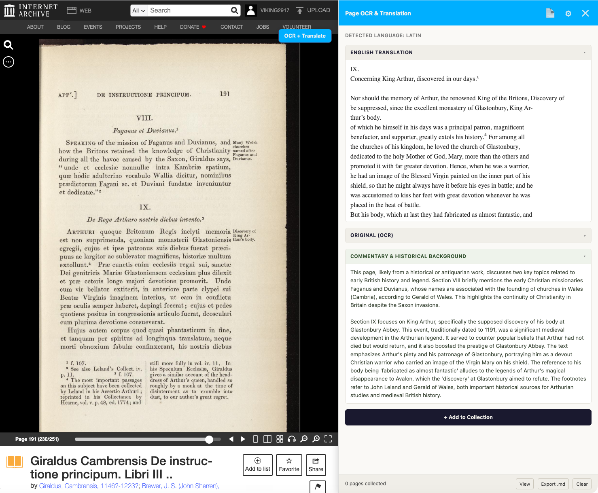

# Bookxlate: Internet Archive OCR + Translate
A chrome extension for translating books in the Internet Archive. 

## Read books in any language
Ever needed to read a book written in a language you don't speak? Tired of copy/paste ad infinitum (that's Latin, see what I did there?) This extension is your answer.

Open an Internet Archive book, set the page view to single mode, and hit the OCR + Translate button. The extension will open a sidebar with the translated text, the original text below it, and finally any historical / contextual background the AI engine thinks you might want to know.

Internet Archive OCR is also notoriously inaccurate, especially for documents not in English, older documents, or documents with poor scans. Gemini OCR is noticeably better, so even for English documents you will see better raw text than if you simply copy the Internet Archive text.

*Screenshot showing translation of a passage by Gerald of Wales describing the discovery of the burial of King Arthur*

A bit more detail at the [blog post](https://www.viking2917.com/translating-internet-archive-books-on-the-fly/).

## How it works

The extension is powered by Google Gemini. You will need a (free!) Google API key.
Get a free key at <a href="https://aistudio.google.com/apikey" target="_blank" rel="noopener">
      aistudio.google.com/apikey</a>. The key is stored locally in your browser via chrome.storage.local — never sent anywhere except directly to Google's API. <strong>Required</strong> before the extension can OCR or translate anything. The first time you invoke the plugin, it will take you to the settings page to enter your key. Thereafter, you should be good.

## Caveats

This extension only works for the Internet Archive, at least currently. 

With a free API key, Gemini will often report a failure and that the model is overloaded. Just try again, usually it will work.

This extension is mostly coded by Claude AI. I've reviewed the code, but *caveat emptor* (there's that Latin again).

## Installation

You should be able to install this from the Chrome Web Store. If you want to run it via a local install, zip up everything in the "src" directory, and load it as an unpacked extension (e.g. follow these instructions: https://developer.chrome.com/docs/extensions/get-started/tutorial/hello-world)

To package for submission: 'rm src/.DS_Store; rm src/icons/.DS_Store; cd src;zip -r ../extension.zip .'